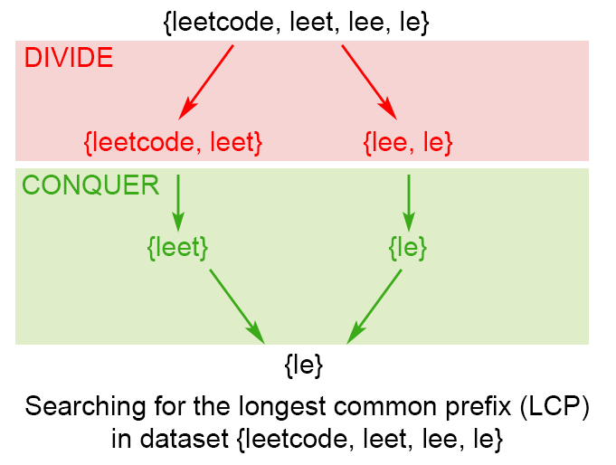

# 14. Longest Common Prefix
分类： String

[题目的地址](https://leetcode.com/problems/longest-common-prefix/)，简单说一下大意：

给定包含字符串的数组，找出最长的共同前缀

Example 1:
```
Input: ["flower","flow","flight"]
Output: "fl"
```

## 解法
### 1. Horizontal scanning
我们可以取第一个字符串为基准 `prefix` ，每次和后一个字符串比较，取得共同前缀，以此类推，直至数组内所有字符串遍历完毕或 `prefix == ""` 。 

代码如下 ( Python )：
``` python
class Solution_Horizontal_Scanning:
    def longestCommonPrefix(self, strs: List[str]) -> str:
        if len(strs) == 0:
            return ""
        prefix = strs[0]
        for s in strs:
            while not s.startswith(prefix):
                prefix = prefix[:-1]
                if prefix == "" :
                    return ""
        return prefix
```
时间复杂度是 O(n * len(strs[1..n])) ， 即所有字符串的长度和。
有两个极端情况：
1. 当长度最小的字符串在数组最后的话，我们要做 `len(strs)` 次比较，才得出最后的结果
2. 所有字符串都相等，且长度为 n 。那么时间复杂度为 `O(n^2)`

### 2. Vertical scanning
每次比较的是数组内所有字符串相同位置的字符，当有不同的情况出现，则说明共同最长前缀已经找到了。
``` python 
class Solution_Vertical_Scanning:
    def longestCommonPrefix(self, strs: List[str]) -> str:
        if len(strs) == 0:
            return ""
        for i in range(0, len(strs[0])):
            c = strs[0][i]
            for j in range(1, len(strs)):
                if i == len(strs[j]) or c != strs[j][i]:
                    return strs[0][:i]
```
时间复杂度是 O(n * len(strs[1..n])) ， 即所有字符串的长度和。

### 3. Divide_And_Conquer
经典分治法，每次都将数组分成两部分，取各自的前缀，最后再比较两部分的结果。

``` python
class Solutio_Divide_And_Conquer:
    def longestCommonPrefix(self, strs: List[str]) -> str:
        if len(strs) == 0:
            return ""
        return self.longestCommonPrefixA(strs, 0, len(strs) - 1)

    def longestCommonPrefixA(self, strs: List[str], start:int, end:int) -> str:
        if start == end:
            return strs[start]
        mid = int((start + end) / 2)
        prefix_l = self.longestCommonPrefixA(strs, start, mid)
        prefix_r = self.longestCommonPrefixA(strs, mid+1, end)
        return self.commonPrefix(prefix_l, prefix_r)
        
    def commonPrefix(self, left: str, right: str) -> str:
        l = min(len(left), len(right))
        for i in range(0, l):
            if left[i] != right[i]:
                return left[:i]
        return left[:l]
```
