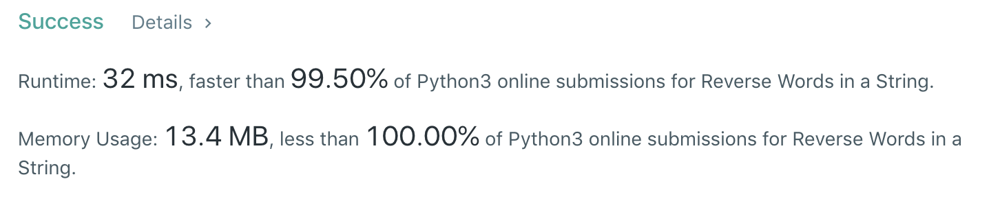
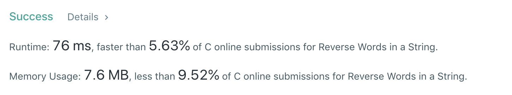

# 151. Reverse Words in a String
分类： String

[题目的地址](https://leetcode.com/problems/reverse-words-in-a-string/)，简单说一下大意：

给定一个有多个单词，用不等量个空格分隔开的字符串，将其中的单词倒序，组成一个新的字符串。

Example 1
```
Input: "the sky is blue"
Output: "blue is sky the"
```

Example 2
```
Input: "  hello world!  "
Output: "world! hello"
注意前后的空格
```

Example 3
```
Input: "a good   example"
Output: "example good a"
注意中间的空格
```

这道题的难易程度是 MEDIUM

## 解决方法

代码如下（Python）：
``` python
class Solution:
    def reverseWords(self, s: str) -> str:
        return " ".join(s.split()[::-1])
```
一行 Python 解决问题，还挺快的。🕊

时间复杂度和空间复杂度都是 `O(n)` 。

这一题的难度是中等，但似乎并不是那么难..

但是在题目的最后，对 C 语言使用者提出了这样一个要求：

`For C programmers, try to solve it in-place in O(1) extra space.`

于是乎，我也用 C 写了一个，做法是：
1. 先 trim 和除去重复的空格
2. 将整个字符串的字符 reverse 一遍
3. 遍历第 1 步的数组，将每个单词再 reverse 一遍

解法跟 [189.Reverse](https://github.com/objchris/LeetCodePearl/tree/master/189.Rotate%20Array#2reverse) 的思路一样

代码如下（ C ）：
``` c
void c_swap(char *left, char *right) {
    char temp = *left;
    *left = *right;
    *right = temp;
}

void deleteDuplicateSpace(char *s) {
    char *p = s;
    char *q = s;
    while(*q) {
        if(!(isspace(*q) && isspace(*(q+1)))) {
            *p++ = *q;
        }
        q++;
    }
    *p = '\0';
}

void c_reverse(char *s, int start, int end) {
    end--;
    while(start < end) {
        c_swap(&s[start++], &s[end--]);
    }
}

char * reverseWords(char * s){
    if(s == 0 || *s == '\0') {
        return s;
    }
    while (isspace(*s)) {
        s++;
    }
    char *p = s + strlen(s) - 1;
    while (p >= s && isspace(*p)) {
        *p = '\0';
        --p;
    }
    deleteDuplicateSpace(s);
    int len = strlen(s);
    c_reverse(s, 0, len);
    int start = 0;
    for (int end=0; end < strlen(s); end++) {
        if(isspace(s[end])) {
            c_reverse(s, start, end);
            start = end + 1;
        }
    }
    c_reverse(s,start, strlen(s));
    return s;
}
```

C 大概都还给大学老师了吧，写起来很是手涩。

结果是： 🐌🐌🐌🐌🐌🐌🐌🐌🐌🐌🐌🐌


下面是 10 ms 内的解决方式，基本是一样的：
``` C
void swap_range(char* s, int b, int e) { 
    while(e > b) { 
        char x = s[b];
        s[b] = s[e];
        s[e] = x;
        e--, b++;
    }
}

char * reverseWords(char * s){
    int i = 0; 
    int j = 0;
    int b = 0;
    int e = strlen(s) - 1;

    //reverse all string
    swap_range(s, b, e);
    
    //reverse word
    while(true) { 
        while(s[j] == ' ') j++;
        i = j;
        while(j <= e && s[j] != ' ') j++;
        swap_range(s, i, j-1);
        if(j > e) break;
    }
    
    //clean up whitespace
    int c = 0;
    b = 0;
    while(b <= e) { 
        if(s[b] != ' ') {
            s[c++] = s[b];
        } else if(c != 0 && s[c-1] != ' ') {
            s[c++] = ' ';
        }
        b++;
    }
    if (c > 0 && s[c-1] == ' ') { s[c-1] = '\0'; }  else  { s[c] = '\0'; }  
    return s;
}
```
