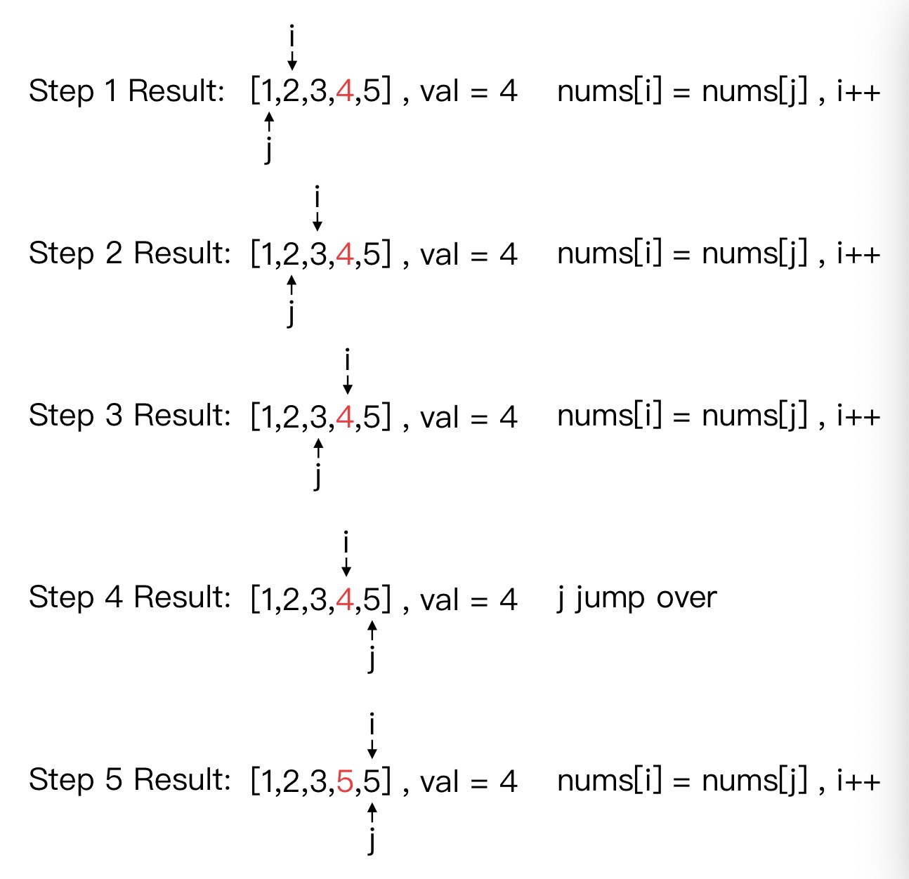
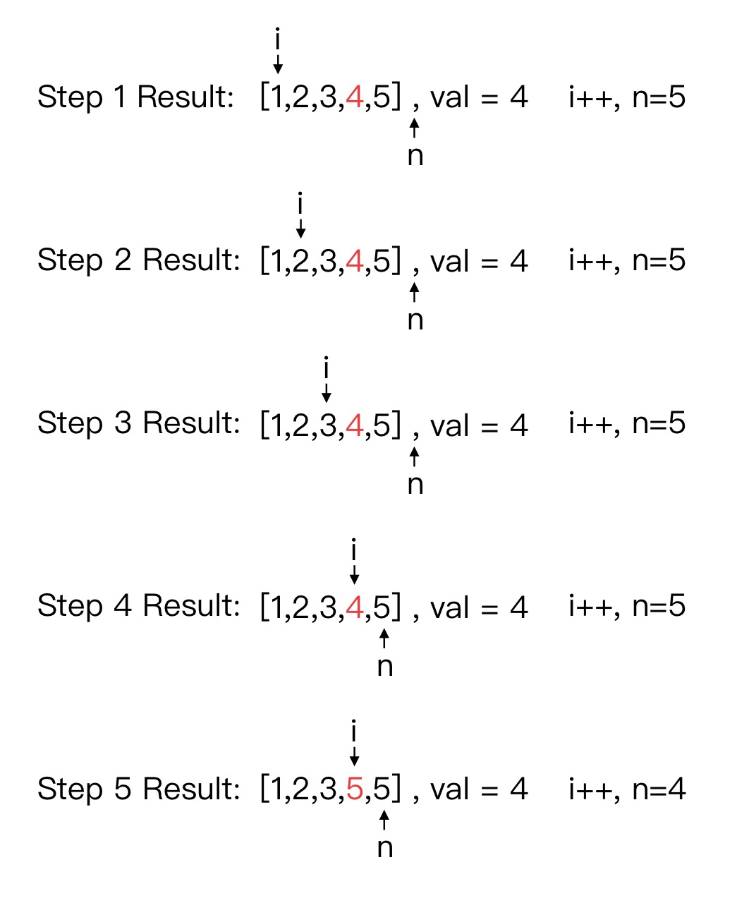

# 27. Remove Element
分类： Array

[题目的地址](https://leetcode.com/problems/remove-element/)，简单说一下大意：

给定一个数组 `nums` 和一个数字 `val` ，在不开拓新的内存的前提下，删除 `nums` 中所有的 `val` ，并返回剩下的数组的长度 `length` 。最终解是取 `nums` 的前 `length` 个元素（在 `nums` 中可不分先后）。

这道题的难易程度是 EASY

思路：

1. 删除数组中所有的 `val` 值，最后返回数组长度
2. 遍历数组，用其他下标对应的值将替换掉 `val` 的值

## 第一种：🐈
``` python
class Solution:
    def removeElement(self, nums: List[int], val: int) -> int:
        while val in nums:
            nums.remove(val)
        return len(nums)
```
一开始，我的做法是这样，可能这是大部分人最快能想到的，但是，这种方式却是较慢的。因为很多语言，如这里的 python ，`remove` 方法是遍历整个数组，极端情况下，例如`[1,2,3,4,5,5,5,5,5]` 每次都基本要遍历整个数组，时间复杂度是 `O(n^2)` 

优点可能就是简洁易懂吧。

## 第二种：🐎
``` python
class Solution:
    def removeElement(self, nums: List[int], val: int) -> int:
        i = 0
        for j in range(0, len(nums)):
            if nums[j] != val:
                nums[i] = nums[j]
                i+=1
        return i
```
这种方式使用两个指示符：Fast Pointer（j） 和 Slow Pointer（i）。将数组中所有非 `val` 的值统统往前搬，时间复杂度是`O(n)`。

步骤如下:


但也存在着极端情况：如`[1,2,3,5,4]`和`[4,1,2,3,5]`。将本可不移动的`[1,2,3,5]`都做了一次赋值操作。

### 改进：🕊
``` python
class Solution:
    def removeElement(self, nums: List[int], val: int) -> int:
        i = 0
        n = len(nums)
        while i < n :
            if nums[i] == val :
                nums[i] = nums[n - 1]
                n -= 1
            else :
                i += 1
        return n
```

步骤如下:


