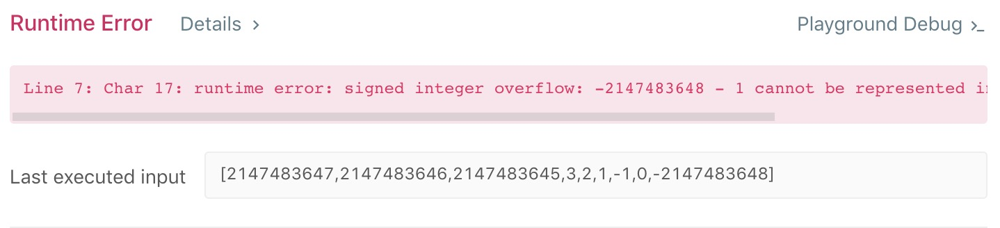

# 41. First Missing Positive
分类： Array

[题目的地址](https://leetcode.com/problems/first-missing-positive/)，简单说一下大意：

给定一个无序数组 `nums` ，找到其中缺失的最小的正整数。如：

Example 1
```
Input: [1,2,0]
Output: 3
```
Example 2
```
Input: [3,4,-1,1]
Output: 2
```
要求：时间复杂度：`O(n)`， 空间复杂度`O(1)`

这道题的难易程度是 HARD

## 我的思路
需要先理清的点：
- 对于长度为 length 的数组，缺失的最小正整数总是在 [1, length] 之间

接下来就是解题步骤了：

1、先不考虑空间复杂度的情况，尝试解决问题：

开拓一个长度为 length 的新数组 `newNums` ，遍历 `nums` ，将其中在 `[1, length]` 区间内的值按照对应的下标填到新数组中，然后再遍历新数组，若有 `newNums[i] != i + 1` , 则 `i + 1` 就是答案，否则，`length + 1` 就是答案。
``` cpp
// 时间复杂度 O(n) | 空间复杂度 O(n)
class Solution {
public:
    int firstMissingPositive(vector<int>& nums) {
        int len = nums.size();
        vector<int> newNums(len, 0);
        for(int i=0; i<len; i++) {
            if(nums[i] > 0 && nums[i] <= len) {
                newNums[nums[i] - 1] = nums[i];
            }
        }
        for(int i=0;i<len;i++) {
            if(newNums[i] != i + 1) {
                return i + 1;
            }
        }
        return len + 1;
    }
};
```

2、考虑 `O(1)` 的情况，我们可以直接在 `nums` 数组中做到第一步要做的事情，代码类似 [189 的 cyclic-replacements](https://github.com/objchris/LeetCodePearl/tree/master/189.Rotate%20Array#1cyclic-replacements) 一般。代码如下（C++）：

``` cpp
// 时间复杂度 O(n) | 空间复杂度 O(1)
class Solution {
public:
    int firstMissingPositive(vector<int>& nums) {
        int len = nums.size();
        for(int i=0; i<len; i++) {
            int prev = nums[i];
            int next = prev - 1; //index of prev
            while(next < len && next >= 0 && nums[next] != prev) {
                swap(nums[i], nums[nums[i] - 1]);
            }
        }
        for(int i=0;i<len;i++) {
            if(nums[i] != i + 1) {
                return i + 1;
            }
        }
        return len + 1;
    }
};
```
当我测试了提交代码的时候，得到的是 Runtime Error 。

如截图，原因是其中有一个 Test Case：`[2147483647,2147483646,2147483645,3,2,1,-1,0,-2147483648]` ，在 `int next = prev - 1;` 这行代码执行的过程中，导致 int 型越界。这个也是需要考虑的东西。

Debug 也是比较简单，不做 -1 的操作就可以了，把 `for loop` 中的代码改成：
``` cpp
for(int i=0; i<len; i++) {
    while(nums[i] <= len && nums[i] > 0 && nums[nums[i] - 1] != nums[i]) {
        swap(nums[i], nums[nums[i] - 1]);
    }
}
```

