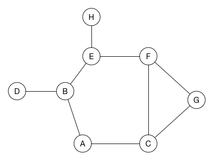

# 797. All Paths From Source to Target

[题目的地址](https://leetcode.com/problems/all-paths-from-source-to-target/description/)，简单说一下大意：

给定一个图，其中有N个节点，节点间没有回环。要求找到所有可以从节点0到节点N-1的路径。

```
Example:
Input: [[1,2], [3], [3], []] 
Output: [[0,1,3],[0,2,3]] 
Explanation: The graph looks like this:
0--->1
|    |
v    v
2--->3
There are two paths: 0 -> 1 -> 3 and 0 -> 2 -> 3.
```

看到题目，笔者的第一想法就是，因为入参是二维数组，拿到的第0个节点是一个数组，表示可以到达的节点。因此获取节点0的数组，遍历该数组，拿到其他节点可以到达的其他节点，重复此操作，知道节点为空数组（表示无法继续前进）。

这道题涉及到一个我们都很熟悉的经典算法：深度优先搜索( *Depth First Search* )，简称DFS，借[raywenderlich](https://github.com/raywenderlich/swift-algorithm-club/tree/master/Depth-First%20Search)一张动图来说明：



A为根节点，DFS会从A节点开始，一直遍历到叶子节点，再返回到中间节点，判断中间节点是否有未遍历的节点，有则遍历，没有则继续返回到上一层。知道所有节点都遍历完毕。

### Swift解法🐌

首先，我的解法：有点无奈，击败了LeetCode 0%的解题者。思路上没错，但实现上有问题。`findPath`方法是用来遍历节点，找到节点所能到达的下一个节点，然后递归调用去重复找路径的工作。每调用一次就创建一个数组。

实现上有以下几个问题：

1. 有过多的数组创建和赋值操作，每次调用找路径方法都会创建一个二维数组。
2. 很多包含在结果数组中的路径并不是目标路径。
3. 因为第2点，在返回最终结果时还需要遍历二维数组，判断其中的路径是否都包含节点0和节点N-1。

```Swift
class Solution {
    func allPathsSourceTarget(_ graph: [[Int]]) -> [[Int]] {
        let max = graph.count - 1
        return findPath(0, graph).filter({ $0.contains(0) && $0.contains(max)})
    }
    
    func findPath(_ index: Int, _ graph:[[Int]]) -> [[Int]] {
        if graph[index].count == 0 {
            return [[index]]
        }
        var ans = [[Int]]()
        for node in graph[index] {
            findPath(node, graph).map({ (path) -> [Int] in
                var temp = Array.init(path)
                temp.insert(index, at: 0)
                ans.append(temp)
                return path
            })
        }
        return ans
    }
}
```

下面的Swift答案是最快的实现方式，52ms，100%beats🕊：

这种实现方式同样是DFS，但少了很多次赋值和最后一次遍历整个结果数组的操作。

```Swift
class Solution {
    func allPathsSourceTarget(_ graph: [[Int]]) -> [[Int]] {
        let array = graph[0]
        var result = [[Int]]()
        pathSourceTarget(graph,array,&result,[0])
        return result
    }
    
    func pathSourceTarget(_ graph: [[Int]] ,_ target:[Int],_ result:inout [[Int]],_ array:[Int]) {
        for i in 0 ..< target.count {
            var newArray = array
            newArray.append(target[i])
            if target[i] == graph.count-1 {
                result.append(newArray)
            }
            else {
               pathSourceTarget(graph,graph[target[i]],&result,newArray)
            }
        }
    }
}
```

在此基础上，我们有：

### C 、C++


### python3 