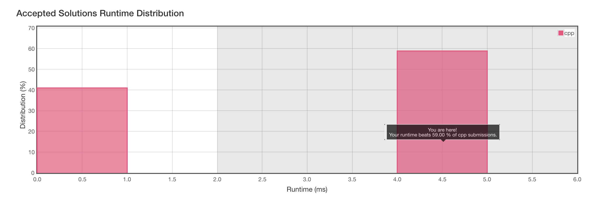

# 921. Minimum Add to Make Parentheses Valid

[原题在此](https://leetcode.com/problems/minimum-add-to-make-parentheses-valid/)

简单描述一下题目：

给出一个仅包含 `(` 和 `)` 的字符串。以 `()` 的样式两两配对后，求剩下的需要多少个半括号才能配对完。

例子 1：

```
Input: "())"
Output: 1
```

例子 2：

```
Input: "((("
Output: 3
```

例子 3：

```
Input: "()))(("
Output: 4
```


### 我的解题思路

看到按顺序配对，就可以想到用栈 stack 来实现，先进后出的实现用来解决这种按顺序的配对再合适不过了。

#### C++ 🐎 （ 4ms, beats 59% ）

```c++
class Solution {
public:
    int minAddToMakeValid(string S) {
        stack<char> ans;
        for (int i=0; i<S.size(); i++) {
            if(ans.empty()) {
                ans.push(S[i]);
                continue;
            }
            if(S[i] == ')' && ans.top() == '(') {
                ans.pop();
                continue;
            }
            ans.push(S[i]);
        }
        return ans.size();
    }
};
```

看起来像是比较优的解法，但是看结果并不是：



两极分化还挺严重，看了排名靠前的代码：也是用栈来实现的：

```c++
class Solution {
public:
    int minAddToMakeValid(string S) {
        stack<int> ss;
        int res = 0;
        for(int i=0;i<S.size();i++){
            if(S[i] == '('){
                ss.push(S[i]);
            }else if(S[i] == ')' && !ss.empty()){
                ss.pop();
            }else{
                res++;
            }
        }
        res = res + ss.size();
        return res;
    }
};
```

问题就在，我的解法是判断字符是 `(` 或 stack 是 `empty()` 的时候 `push` 。有可能把 `)` 也 `push` 到 stack 里面。`push` 和 `pop` 都是相对耗时的操作，所以执行效率没有那么快，在于细节上处理不好。

#### Python3

另一种不使用栈的解法，就用 Python3 来展现吧：

```python
class Solution(object):
    def minAddToMakeValid(self, S):
        """
        :type S: str
        :rtype: int
        """
        
        while "()" in S:
            S = S.replace("()", "")
        
        return len(S)
```

多次循环去除字符串中的子串 `()` ，最后得到的结果就是答案了。

#### Swift

Swift 的数组自带 `popLast` ，可直接当做栈来使用。

```swift
class Solution {
	func minAddToMakeValid(_ S: String) -> Int {
        var ans = 0;
        var arr = [Character]()
        for c in S {
            if c == '(' {
                arr.append(c)
            } else if c == ')' && !arr.isEmpty {
                arr.popLast()
            } else {
                ans += 1
            }
        }
        ans += arr.count
        return ans
    }
}
```

