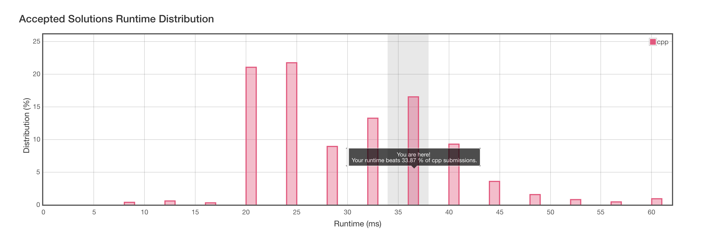

# 929. Unique Email Addresses

[原题在此](https://leetcode.com/problems/unique-email-addresses/)

简单描述一下题目：

email 地址由小写字母的 local name 、@ 、domain name 组成。

其中 local name 中可能会包含 `+` 和 `.`

`+` : 任何在加号后面的符号都会被忽略。

`.` : 点号可忽略，如`alice.z@leetcode.com` 和 `alicez@leetcode.com `是视为相同的。

现给出一个数组，其中有 1 - 100 个不定的邮件地址，找出其中有多少个在意义上是不同的。


### 我的解题思路

首先，遍历数组内所有元素，对 email 的字符逐个处理，设置两个变量：

1. 是否忽略字符：`should_ignore` ，用于处理 `+`
2. 是否为domain ：`domain` ，用于处理 `.`

遇到 `+` 号，将 `should_ignore `置为 `true` ，遇到 `@` ，将 `should_ignore` 置为 `false` 、同时将 `domain ` 置为 `true` 。遍历完整个 email 后，将应该保留下来的字符变成新的字符串存在 set 中，最后返回 `set.size()`

#### C++ 🐈

```c++
class Solution {
public:
    int numUniqueEmails(vector<string>& emails) {
        set<string> s;
        string temp = "";
        bool should_ignore;
        bool domain;
        for (int i=0; i<emails.size(); i++)
        {
            should_ignore = false;
            domain = false;
            string email = emails[i];
            for (int j=0; j<email.size(); j++)
            {
                if (email[j] == '+')
                {
                    should_ignore = true;
                }
                if (email[j] == '@')
                {
                    should_ignore = false;
                    domain = true;
                }
                if (!should_ignore)
                {
                    if (domain || email[j] != '.')
                    temp += email[j];
                }
            }
            s.insert(temp);
            temp = "";
        }
        return (int)s.size();
    }
};
```

测试后提交，Er.... 有点慢：



参考一下排名靠前的代码，发现基本实现方式一致，不同的是 `set` 被替换成 `unordered_set` 。还有一处让人印象深刻的代码：

```c++
auto __ =[]()
{
    std::ios::sync_with_stdio(false);
    cin.tie(nullptr);
    return nullptr;
}();
```

这...让我有点摸不着头脑。

[C++的輸出入cin/cout和scanf/printf誰比較快？](http://chino.taipei/note-2016-0311C-%E7%9A%84%E8%BC%B8%E5%87%BA%E5%85%A5cin-cout%E5%92%8Cscanf-printf%E8%AA%B0%E6%AF%94%E8%BC%83%E5%BF%AB%EF%BC%9F/) 参考这篇文章，在很浅的层面上大致可以理解为什么上述代码会使一段代码的运行速度变得更快些，我简单地说明一下：

本题的测试用例是纯文本格式，且测试用例的数量在非常多地情况，会导致输入 cin 变得很慢，可能会有 Time Limit Error (做 ACM 的大佬简称 TLE 的错误，不是 Leetcode 的 Time Limit Exceeded )。

而 cin 与 cout 的绑定会导致每次 cin 的时候需要对 cout 的缓冲区做一次 flush 。对缓冲区的操作就造成了速度上有所影响。

我不能讲得很详细，请多多参考给出的文章吧。虽然这种解决方法不是从算法层面上去使执行更有效率，但对 IO 的优化也是我们日常需要注意的地方。

#### Python3

```python
class Solution:
    def numUniqueEmails(self, emails):
        """
        :type emails: List[str]
        :rtype: int
        """
        s = set()
        for email in emails:
        	should_ignore = False
        	domain = False
        	temp = ""
        	for char in email:
        		if char == '+':
        			should_ignore = True
        		if char == '@':
        			should_ignore = False
        			domain = True
        		if not should_ignore:
        			if domain or char != '.':
        				temp += char
        	s.add(temp)
        	temp = ""
        return len(s)
```


这一次，不和 Swift 玩。