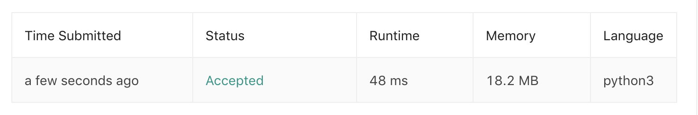

# 105.Construct Binary Tree from Preorder and Inorder Traversal

[原题在此](https://leetcode.com/problems/construct-binary-tree-from-preorder-and-inorder-traversal/)

难度：MEDIUM

题目大意：给定一棵树的前序遍历和中序遍历结果，还原这棵树
```
给定：
preorder = [3,9,20,15,7]
inorder = [9,3,15,20,7]

还原：
    3
   / \
  9  20
    /  \
   15   7
```
## 思路
树的前中后序遍历结果都有规律，以题干为例：左子树、根、右子树的顺序体现为：

- 前序：[根节点,<左子树>,<右子树>]，如题: `[[3],[9],[20,15,7]]` ，`[20,15,7]` 也同样：`[[20],[15],[7]]`
- 中序：[<左子树>,根节点,<右子树>]，如题: `[[9],[3],[15,20,7]]` ，`[15,20,7]` 也同样：`[[15],[20],[7]]`
- 后序：[<左子树>,<右子树>,根节点]

左、根、右肯定是各自成堆出现在结果中。

用递归的时候我们就可以针对这一性质，每次递归时缩小给定数组的长度，而不是对整个数组进行操作。

于是，有递归的 Python3 代码如下 🕊：
``` python
class Solution:
    def buildTree(self, preorder: List[int], inorder: List[int]) -> TreeNode:
        if not preorder:
            return None
        map_in = {v:i for i,v in enumerate(inorder)}
        preorder_queue = collections.deque(preorder)
        def recursive(start:int, end:int) -> TreeNode:
            if start > end:
                return None
            mid = TreeNode(preorder_queue.popleft())
            midIndex = map_in[mid.val]
            mid.left = recursive(start, midIndex-1)
            mid.right = recursive(midIndex+1, end)
            return mid
        return recursive(0, len(preorder) - 1)
```
