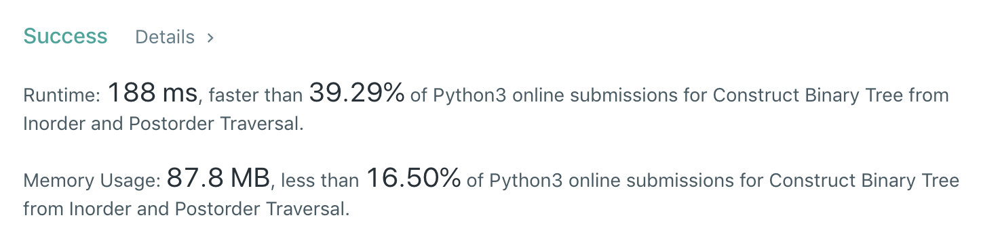

# 106.Construct Binary Tree from Inorder and Postorder Traversal

[原题在此](https://leetcode.com/problems/construct-binary-tree-from-inorder-and-postorder-traversal/)

难度：MEDIUM

题目大意：给定一棵树的中序遍历和后序遍历结果，还原这棵树
```
给定：
inorder = [9,3,15,20,7]
postorder = [9,15,7,20,3]

还原：
    3
   / \
  9  20
    /  \
   15   7
```
## 思路
树的前中后序遍历结果都有规律，以题干为例：左子树、根、右子树的顺序体现为：

- 前序：[根节点,<左子树>,<右子树>]
- 中序：[<左子树>,根节点,<右子树>]，如题: `[[9],[3],[15,20,7]]` ，`[15,20,7]` 也同样：`[[15],[20],[7]]`
- 后序：[<左子树>,<右子树>,根节点]，如题: `[[9],[15,7,20],[3]]` ，`[15,7,20]` 也同样：`[[15],[7],[20]]`

左、根、右肯定是各自成堆出现在结果中。

用递归的时候我们就可以针对这一性质，每次递归时缩小给定数组的长度，而不是对整个数组进行操作。

于是，有递归的 Python3 代码如下 🐈：
``` python
class Solution:
    def buildTree(self, inorder: List[int], postorder: List[int]) -> TreeNode:
        if not inorder:
            return None
        mid = postorder[-1]
        midIndex = inorder.index(mid)
        root = TreeNode(mid)
        if midIndex > 0:
            root.left = self.buildTree(inorder[0:midIndex], postorder[0:midIndex])
        if midIndex < len(inorder)-1:
            root.right = self.buildTree(inorder[midIndex+1:len(inorder)], postorder[midIndex:-1])
        return root
```
每次对 inorder 和 postorder 进行截取，使得进入递归时中序和后序对应的是同一棵子树。

但是这样很慢，遇到巨大的树时空间复杂度就是灾难。


反思一下，这样不好的原因在于，每次递归前都要对数组进行截取，传递时的参数也是很大，可以稍微改进一下：
``` python
class Solution:
    def buildTree(self, inorder: List[int], postorder: List[int]) -> TreeNode:
        if not inorder:
            return None
        map_in = {v:i for i,v in enumerate(inorder)}
        def recursive(start:int, end:int) -> TreeNode:
            if start > end:
                return None
            node = TreeNode(postorder.pop())
            midIndex = map_in[node.val]
            node.right = recursive(midIndex + 1, end)
            node.left = recursive(start, midIndex - 1)
            return node
        return recursive(0, len(postorder) - 1)
```
这样的话，递归的成本就变得比较低。空间复杂度也就只是 `O(n)` 。