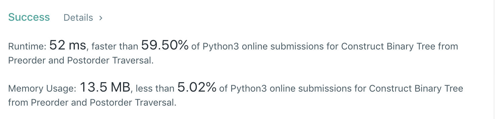

# 889.Construct Binary Tree from Preorder and Postorder Traversal

[原题在此](https://leetcode.com/problems/construct-binary-tree-from-preorder-and-postorder-traversal/)

难度：MEDIUM

题目大意：给定一棵树的前序遍历和后序遍历结果，还原这棵树
```
给定：
pre = [1,2,4,5,3,6,7]
post = [4,5,2,6,7,3,1]

还原：
    1
   / \
  2   3
 / \ / \
4  5 6  7
```
## 思路
树的前中后序遍历结果都有规律，以题干为例：左子树、根、右子树的顺序体现为：

- 前序：[根节点,<左子树>,<右子树>]
- 中序：[<左子树>,根节点,<右子树>]
- 后序：[<左子树>,<右子树>,根节点]

左、根、右肯定是各自成堆出现在结果中。

用递归的时候我们就可以针对这一性质，每次递归时缩小给定数组的长度，而不是对整个数组进行操作。

像 105、106 中有中序遍历的结果，其还原的树是唯一的。只有前序和后序，使得答案变得多样了起来。

我们知道，前序遍历第一位和后序遍历最后一位是根节点。难就难在：取得一个根，如何找到该根节点的左树的节点数和右树的节点数，当然，对于这两个数量，求得一个也就是两个都知道了。

假设 L 为左树的节点数量，那么根据上面的规律，可得： `pre[1] == post[L - 1] //根节点下标为 0` 时，可得 L 值，以此类推继续求各个子树。

于是，有递归的 Python3 代码如下 🐎：
``` python
class Solution:
    def constructFromPrePost(self, pre: List[int], post: List[int]) -> TreeNode:
        def recursive(l:int, r:int, N:int) -> TreeNode:
            """
            l:pre下标起始
            r:post下标起始
            N:该树共有多少个节点
            """
            if N == 0:
                return None
            root = TreeNode(pre[l])
            if N == 1:
                return root

            # 求左子树的节点数量 L , N - L - 1 即为右子树
            for L in range(N):
                if post[r + L - 1] == pre[l + 1]:
                    break

            root.left = recursive(l+1, r, L)
            root.right = recursive(l+1+L, r+L , N-1-L)
            return root
        return recursive(0, 0, len(pre))
```

