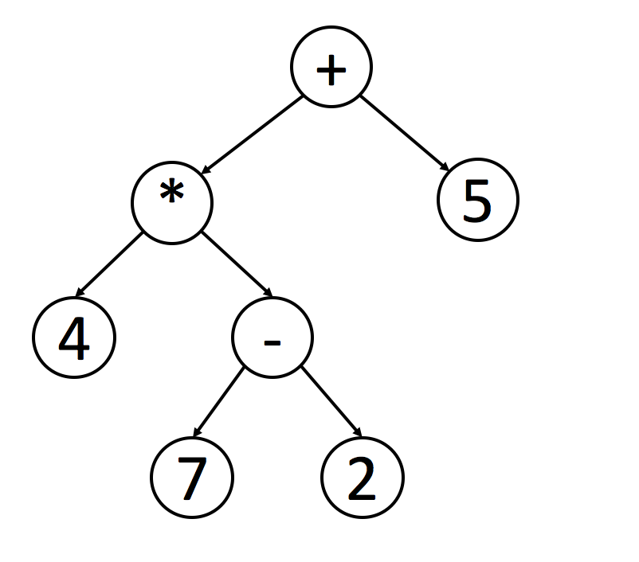

# 二叉树

## 题目

| No.  | Problem | Difficulty | Algorithm | Solution |
| ---- | ------- | ---------- | --------- | -------- |
| 101  | Symmetric Tree | Easy | Binary Tree | [对称的树](101.Symmetric%20Tree) |
| 102  | Binary Tree Level Order Traversal | Medium | BFS | [广度遍历](#%E5%B9%BF%E5%BA%A6%E9%81%8D%E5%8E%86-bfs) |
| 112  | Path Sum | Easy | Binary Tree | [Note here](112.Path%20Sum) |
| 797  | All Paths From Source to Target | Easy | DFS | [Note here](797.All%20Paths%20From%20Source%20to%20Target) |
| 105  | Construct Binary Tree from Preorder and Inorder Traversal | Medium | DFS | [前序和中序建树](105.Construct%20Binary%20Tree%20from%20Preorder%20and%20Inorder%20Traversal) |
| 106  | Construct Binary Tree from Inorder and Postorder Traversal | Medium | DFS | [中序和后序建树](106.Construct%20Binary%20Tree%20from%20Inorder%20and%20Postorder%20Traversal) |
| 144  | Binary Tree Preorder Traversal | Medium | DFS | [前序遍历](#%E5%89%8D%E5%BA%8F%E9%81%8D%E5%8E%86) |
| 94   | Binary Tree Inorder Traversal | Medium | DFS | [中序遍历](#%E4%B8%AD%E5%BA%8F%E9%81%8D%E5%8E%86) |
| 145  | Binary Tree Postorder Traversal | Hard | DFS | [后序遍历](#%E5%90%8E%E5%BA%8F%E9%81%8D%E5%8E%86) |


## 遍历方式：

以下代码中使用到的树节点的结构如下：

``` python
# Definition for a binary tree node.
class TreeNode:
    def __init__(self, x):
        self.val = x
        self.left = None
        self.right = None
```
### 深度遍历 DFS

深度遍历方式：前序遍历、中序遍历、后序遍历

前序遍历貌似没有什么应用场景

对于二叉搜索树而言，中序遍历之后就是 sorted array

后序遍历对于删除操作很有作用，因为在删除节点时，需要先删除它的左节点和右节点。

还有就是将数学表达式转换成二叉树的形式进行计算：

使用中序遍历可以输出表达式：4 * 7 - 2 + 5 ，但是计算的优先级已经没有了

使用后序遍历就保留了计算优先级： ( ( 4 ( 7 2 + )  * )  5 + ) 

#### 前序遍历
一、递归方式
``` python
class Solution_Recursive:
    def preorderTraversal(self, root: TreeNode) -> List[int]:
        r = []
        if root is None or root.val is None:
            return r
        r = [root.val]
        if root.left is not None:
            r += self.preorderTraversal(root.left)
        if root.right is not None:
            r += self.preorderTraversal(root.right)
        return r
```
二、循环方式

循环的方式需要使用到栈，若有右节点，将右节点压入栈中，当左节点为 `null` 时，从栈中取出右节点继续遍历。
``` python
class Solution_Iteratively:
    def preorderTraversal(self, root: TreeNode) -> List[int]:
        r = []
        nodes = [] # stack 
        while root or nodes:
            if not root:
                root = nodes.pop()
            r += [root.val]
            if root.right:
                nodes.append(root.right)
            root = root.left
        return r
```
见  [LeetCode.144. Binary Tree Preorder Traversal](https://leetcode.com/problems/binary-tree-preorder-traversal/)
#### 中序遍历
一、递归方式
``` python
class Solution_Recursive:
    def inorderTraversal(self, root: TreeNode) -> List[int]:
        r = []
        if root is None or root.val is None:
            return r
        if root.left is not None:
            r += self.inorderTraversal(root.left)
        r += [root.val]
        if root.right is not None:
            r += self.inorderTraversal(root.right)
        return r
```
没什么好说的，跟前序遍历一样，只是 `r += [root.val]` 的位置不同而已。

二、循环方式

中序遍历的循环方式相对复杂些：     

0. 添加变量 `nodes` 用作栈。 
1. 判断当前节点是否为 `null` ，是则将当前节点入栈，进入左节点，直至左节点为 `null` ，进入第 2 步。
2. 从栈中取出节点，将节点的值添加到结果中。
3. 进入右节点，重新到第 1 步循环。
``` python
class Solution_Iteratively:
    def inorderTraversal(self, root: TreeNode) -> List[int]:
        r = []
        nodes = []
        while root or nodes:
            if root:
                nodes.append(root)
                root = root.left
                continue
            root = nodes.pop()
            r += [root.val]
            root = root.right
        return r
```
见[LeetCode.94.Binary Tree Inorder Traversal - LeetCode](https://leetcode.com/problems/binary-tree-inorder-traversal/)
#### 后序遍历
一、递归方式

``` python
class Solution_Recursive:
    def inorderTraversal(self, root: TreeNode) -> List[int]:
        r = []
        if root is None or root.val is None:
            return r
        if root.left is not None:
            r += self.inorderTraversal(root.left)
        if root.right is not None:
            r += self.inorderTraversal(root.right)
        r += [root.val]
        return r
```
二、循环方式
``` python
class Solution_Iteratively:
    def postorderTraversal(self, root: TreeNode) -> List[int]:
        r = []
        nodes = [] # Stack
        last = None
        while root or nodes:
            if root:
                nodes.append(root)
                root = root.left
                continue
            peek = nodes[-1]
            if not peek.right or last == peek.right:
                nodes.pop()
                r += [peek.val]
                last = peek
                root = None
            else:
                root = peek.right

        return r
```
方法二：
``` python
class Solution_Iteratively:
    def postorderTraversal(self, root: TreeNode) -> List[int]:
        rst = []
        stack = []
        while root or stack:
            if root:
                rst.insert(0, root.val)
                stack.append(root)
                root = root.right
            else:
                root = stack.pop().left
        return rst
```
见 [LeetCode.145.Binary Tree Postorder Traversal - LeetCode](https://leetcode.com/problems/binary-tree-postorder-traversal/)

### 广度遍历 BFS

广度遍历更多反应的是树的层级关系，因为它是一层一层地去遍历树中的节点。

一、递归方式
递归的方式每次都要往下传 层数`depth` ，以便下一次递归知道将其值放在什么位置。 
``` python
class Solution_Recursive:
    def levelOrder(self, root: TreeNode) -> List[List[int]]:
        r = []
        self.lo(r, root, 0)
        return r

    def lo(self, order:List[List[int]] , node: TreeNode, depth: int):
        if node is not None:
            if depth >= len(order):
                order.append([])
            order[depth].append(node.val)
            self.lo(order, node.left,depth+1)
            self.lo(order, node.right,depth+1)
```
二、循环方式

循环方式需要借助队列，用于保存每一层的节点，并保证节点的顺序是 FIFO 。
``` python
class Solution_Iteratively:
    def levelOrder(self, root: TreeNode) -> List[List[int]]:
        r = []
        if not root:
            return []
        nodes = collections.deque([]) # Queue
        nodes.append(root)
        while nodes:
            arr = []
            size = len(nodes)
            for i in range(0, size):
                temp = nodes.popleft()
                arr.append(temp.val)
                if temp.left:
                    nodes.append(temp.left)
                if temp.right:
                    nodes.append(temp.right)
            r += [arr]
        return r
```
见 [LeetCode.102.Binary Tree Level Order Traversal](https://leetcode.com/problems/binary-tree-level-order-traversal/)

## 递归说明
以求树的深度为例：

递归的方式有两种：
1. Top-down : 自上而下，如前序遍历，先求得根节点的值，再求子节点的值，最后合在一起。
    ``` c++
    // C++
    int answer = 0;
    void maximum_depth(TreeNode* root, int depth) {
        if (!root) {
            return;
        }
        if (!root->left && !root->right) {
            answer = max(answer, depth);
        }
        maximum_depth(root->left, depth + 1);
        maximum_depth(root->right, depth + 1);
    }
    ```
    ``` python
    # python
    answer = 0
    def maximum_depth(root: TreeNode, depth: int):
        if not root:
            return 
        if not root.left and not root.right:
            answer = max(answer, depth)
        maximun_depth(root.left, depth + 1)
        maximun_depth(root.right, depth + 1)
    ```
2. Bottom-up : 自下而上，如后序遍历，利用子节点求得的结果，归并到根节点求得最后的结果。
    ``` c++
    // C++
    int maximum_depth(TreeNode* root) {
        if (!root) {
            return 0; // return 0 for null node
        }
        int left_depth = maximum_depth(root->left);	
        int right_depth = maximum_depth(root->right);
        return max(left_depth, right_depth) + 1;	  // return depth of the subtree rooted at root
    }
    ```
    ``` python
    def maximum_depth(root: TreeNode):
        if not root:
            return 0
        left_depth = maximum_depth(root.left)
        right_depth = maximum_depth(root.right)
        return max(left_depth, right_depth) + 1;
    ```
    见 [LeetCode.101.Symmetric Tree](101.Symmetric%20Tree)

在遇到树的问题时，往往可以使用递归的方式解决，但是如何递归却是很难找到答案的。

取决于两点：
1. 对于当前节点，是否存在一些参数，让调用方法可以计算出答案
2. 根据当前节点和参数，能否计算出传给子节点的参数

满足条件的话，可以考虑使用 `Top-down` 的形式。

另外，如果计算出子节点的答案，可以归并计算出根节点的答案，那就考虑使用 `Bottom-up` 。
