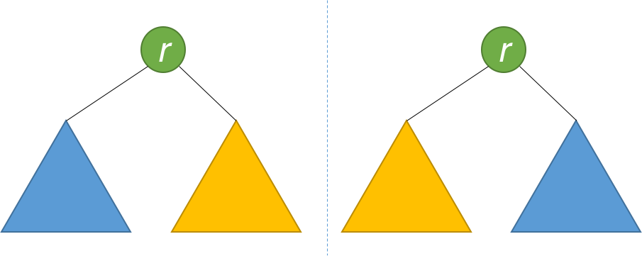

# 101. Symmetric Tree

分类： Binary Tree

难易程度： Easy 

[题目地址](https://leetcode.com/problems/symmetric-tree/)

题目大意如下：给定一棵二叉树，判断是否以 Y 轴对称，如：

Example 1：
```
    1
   / \
  2   2
 / \ / \
3  4 4  3
```
返回 True

Example 2：
```
    1
   / \
  2   2
   \   \
   3    3
```
返回 False

## 思路
从根节点开始，递归判断以左右两个子节点为根节点的子树是否为对称，对称的条件是：
1. left.val == right.val
2. left.left 与 right.right 对称
3. left.right 与 right.left 对称



根据子树的结果最后得出整个结果，可以用 `Bottom-up` 的顺序递归二叉树：

Python3 代码如下： 🕊
``` python
class Solution:
    def isSymmetric(self, root: TreeNode) -> bool:
        if not root:
            return True
        return self.isSymmetricR(root.left, root.right)
        
    def isSymmetricR(self, left: TreeNode, right: TreeNode) -> bool:
        if not left and not right:
            return True
        if not left or not right:
            return False
        return left.val == right.val and self.isSymmetricR(left.left, right.right) and self.isSymmetricR(left.right, right.left)
```

非递归的方式：
``` python
class Solution_Iterative:
    def isSymmetric(self, root: TreeNode) -> bool:
        nodes = collections.deque([])
        nodes.append(root)
        nodes.append(root)
        while nodes:
            n1 = nodes.popleft()
            n2 = nodes.popleft()
            if not n1 and not n2 :
                continue
            if not n1 or not n2:
                return False
            if n1.val != n2.val:
                return False
            nodes.append(n1.left)
            nodes.append(n2.right)
            nodes.append(n1.right)
            nodes.append(n2.left)
        return True

```