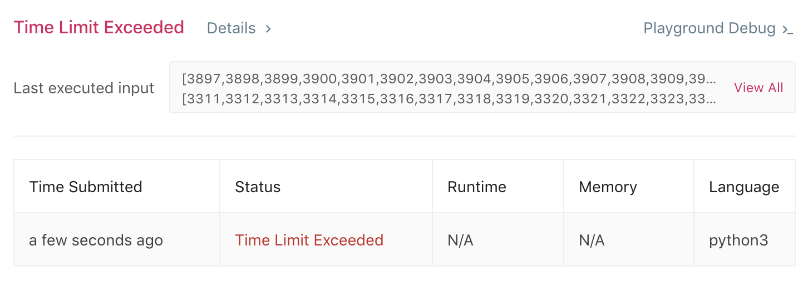
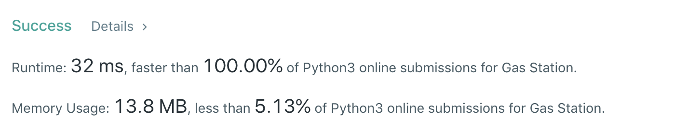

# 134. Gas Station
分类： Array

[题目的地址](https://leetcode.com/problems/gas-station/)，简单说一下大意：

在一条环形的路上，有 N 个加油站，第 i 个加油站有汽油 `gas[i]` ，你开着小汽车，从第 i 个加油站到第 i+1 个加油站需要消耗 `cost[i]` 的汽油，给定两个数组 gas 和 cost 。计算出是否存在从某个加油站出发，顺时针经过所有加油站再回到原点的路线，有则返回出发点的下标，没有则返回 `-1` 。

这道题的难易程度是 MEDIUM

## 思路
### 初试
题目还是很清晰的，步骤：

1. gas[i] >= cost[i] ? 第 2 步 : (i++ ; i >= len(gas) 第 5 步)
2. current = i; 
3. tank - cost[current] >= 0 ? 第 4 步 : i++
4. tank - cost[current] + gas[current + 1] 
5. current + 1 == i ? return i : 回到第 3 步
5. return -1

写成代码就是（ Python ）：🐌 TLE
``` python
class Solution:
    def canCompleteCircuit(self, gas: List[int], cost: List[int]) -> int:
        result = -1
        for i in range(0, len(gas)) :
            if gas[i] < cost[i]:
                continue
            current = i
            tank = gas[i]
            while result == -1:
                if tank - cost[current] < 0 :
                    break
                tank -= cost[current]
                current = (current + 1) % len(gas)
                tank += gas[current]
                if tank >= cost[current] and current == i:
                    result = i
        return result
```
时间复杂度 `O(n^2)` , 既然题目难度是 Medium ，这样的代码提交上去，LeetCode 反手就给你一个 TLE ：


如图这个 [Test Case](https://leetcode.com/submissions/detail/227959322/testcase/) 有点过分， `gas` 和 `cost` 都是有着一万个元素的数组。

### 优化
看回原来的代码，每次发现路径不通时，下一次尝试总是在上一次的起点的下一点重新执行，这是一个很大的问题，为什么呢？

我忽略了很大一个规律：假设 A -> B 这个路径已经是失败的，那么对于任意 C 属于 [A, B] , C -> B 肯定是失败的。

所以，修改一下代码逻辑：
``` python
class Solution:
    def canCompleteCircuit(self, gas: List[int], cost: List[int]) -> int:
        if len(gas) == 1:
            return  0 if gas[0] >= cost[0] else -1
        result = -1
        count = 0 
        i = 0
        while count < len(gas) :
            current = i
            tank = gas[i]
            while result == -1:
                tank -= cost[current]
                if tank < 0 :
                    i = (current + 1) % len(gas)
                    break
                current = (current + 1) % len(gas)
                tank += gas[current]
                count += 1
                if current == i:
                    result = i
        return result
```
这样改后，时间复杂度就变成 `O(n)` 。提交看一下结果：🕊



真是坐过山车的感觉呀。

## Test Case 
- [10000个元素](https://leetcode.com/submissions/detail/227959322/testcase/)
- 只有一个元素，例如： [4]、[5] 和 [5]、[4] 
- 只有一个元素且相等： [2]、[2]