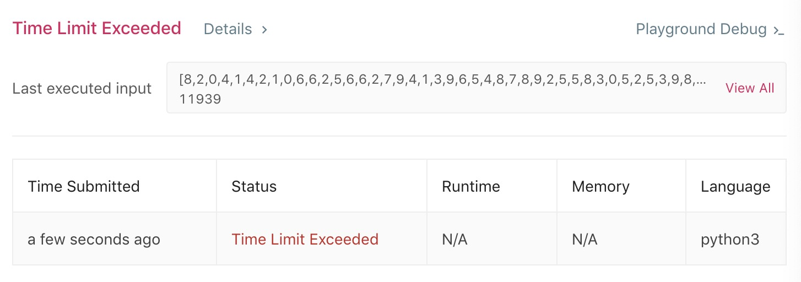
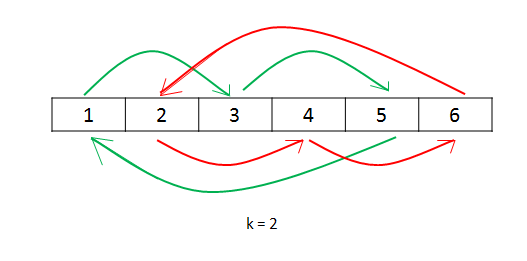

# 189. Rotate Array
分类： Array

[题目的地址](https://leetcode.com/problems/rotate-array/)，简单说一下大意：

给定一个数组 `nums` 和一个数字 `k` ，在不开拓新的内存的前提下，将数组右移 `k` 位。如：
```
Input: [1,2,3,4,5,6,7] and k = 3
Output: [5,6,7,1,2,3,4]
```

这道题的难易程度是 EASY ， 但实际上并不 EASY

## 我的想法
要保持 O(1) 的空间复杂度，最先想到的就是循环 `k` 次，每次保存最后一个值，把整个数组往后移一位，再把保存的值赋给 `nums[0]`。代码如下：
``` python
class Solution:
    def rotate(self, nums: List[int], k: int) -> None:
        """
        Do not return anything, modify nums in-place instead.
        """
        numsLen = len(nums)
        while k != 0:
            end = nums[numsLen - 1]
            for i in range(numsLen - 1, 0, -1):
                nums[i] = nums[i - 1]
            nums[0] = end 
            k -= 1;
```
看起来也没那么难嘛，简单测试后提交：

瞬间打脸，仔细想想也确实是这样，如果数组很大，`k` 值也很大，那么总共需要做的遍历次数和每次要遍历的值的数量也是相当恐怖的：时间复杂度 `O(kn)` ，当 `k` 大于等于 `n` 时，就变成 `O(n^2)` 了。

这就显现了第一个问题：没有考虑 k >= n 的情况。当 k = n 时，数组相当于不用移动，当 k > n 时，只需要移动 `k % n` 次就可以了。所以可以在循环之前加上判断条件，决定要做多少次循环:
``` python
if k >= numsLen:
    k = k % numsLen
```
再次提交：同样的 `TLE` ，证明这样还是不够。我们可以进一步优化：
经过上面第一步优化：我们可以确保 k < n 了。那 k 跟 n/2 有没有关系呢？

题干所示的数组相当于一个环，于是，我们将数组右移 k 位, 就等于将数组左移 n - k 位。如:
```
[1,2,3,4,5,6,7] k = 6
结果是 [2,3,4,5,6,7,1] 
左移只需做一次遍历
右移需要做六次遍历
```
所以决定左移还是右移就取决于 k 与 n/2 孰大孰小。

还有就是，当 k 无限接近于 n 时，n - k 就变得很小，遍历次数将大幅下降，这是很有必要的，因此我想或许可以再加一个判断条件：
``` python
class Solution:
    def rotate(self, nums: List[int], k: int) -> None:
        """
        Do not return anything, modify nums in-place instead.
        """
        numsLen = len(nums)
        if k >= numsLen:
            k = k % numsLen
        if k > numsLen/2:
            # 左移
            k = numsLen - k
            while k != 0:
                start = nums[0]
                for i in range(numsLen - 1):
                    nums[i] = nums[i + 1]
                nums[numsLen - 1] = start
                k -= 1
        else :
            # 右移
            while k != 0:
                end = nums[numsLen - 1]
                for i in range(numsLen - 1, 0, -1):
                    nums[i] = nums[i - 1]
                nums[0] = end 
                k -= 1;
```
这次测试时将前几次 TLE 的 TestCase 用于测试，结果还是不够好。时间复杂度也只是从最初的 `O(n^2)` 变成 `O((n^2)/2)` ，本质上并没有变化。

前面的想法都是尽量在减少 k 值，即遍历的次数，那么每次只移动一位数，是不是太没效率了。能否将 k 次遍历，每次移动 1 个数字变成 n / k 次遍历，每次移动 k 个数字？但是移动 k 个数字相当于要申请 `O(k)` 的内存，违背了题干。


## 答案
苦思无解之后，我翻阅了该题的 `Discuss` 。看到了几个不错的解法：
### 1.Cyclic Replacements


假设从数组的第 `i` 个数开始，找到第 `i + k` 个的数，保存起来，假设为 `temp` ，然后赋值：`nums[i+k] = nums[i]` 。一直重复这个操作，直至回到原点。若数组长度是奇数，则一轮下来后，所有的数都往右移动了 `k` 位，若数组长度是偶数，则一轮过后，还剩下一半没有移动，此时再遍历一遍就可以了。

代码如下（C++）：
``` c++
class Solution {
public:
    void rotate(vector<int>& nums, int k) {
        k = k % nums.size();
        if(k == 0) {
            return ;
        }
        int count = 0;
        for (int start = 0; count < nums.size(); start++) {
            int current = start;
            int prev = nums[current];
            do {
                int next = (current + k) % nums.size();
                int temp = nums[next];
                nums[next] = prev;
                prev = temp;
                count++;
                current = next;
            } while(start != current);
        }
    }
};
```

这种方式的时间复杂度是 `O(k * n/k)` ，即 `O(n)` 。
而空间复杂度是 `O(1)`。

### 2.Reverse
这种解法是对数组的规律进行了分析，对环形数组做移动就相当于对数组做三次 Reverse 操作。
```
Original List                   : 1 2 3 4 5 6 7
After reversing all numbers     : 7 6 5 4 3 2 1
After reversing first k numbers : 5 6 7 4 3 2 1
After revering last n-k numbers : 5 6 7 1 2 3 4 --> Result
```

代码如下（C++）：
``` c++
class Solution {
public:
    void rotate(vector<int>& nums, int k) {
        k = k % nums.size();
        reverse(nums, 0, nums.size() - 1);
        reverse(nums, 0, k-1);
        reverse(nums, k, nums.size() - 1);
    }

    void reverse(vector<int>& nums, int start, int end) {
        while (start < end) {
            int temp = nums[start];
            nums[start] = nums[end];
            nums[end] = temp;
            start++;
            end--;
        }
    }
};

```