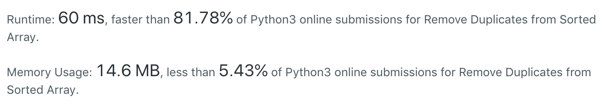
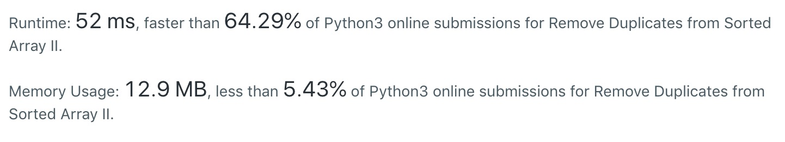

# 26.Remove Duplicates from Sorted Array
分类： Array

[题目的地址](https://leetcode.com/problems/remove-duplicates-from-sorted-array/)，简单说一下大意：

给定一个**已排序的**数组 `nums` ，在不开拓新的内存的前提下，删除其中的重复数字，并返回剩下的数组的长度 `length` 。最终解是取 `nums` 的前 `length` 个元素（在 `nums` 中可不分先后）。

这道题的难易程度是 EASY

这道题与 [27](https://github.com/objchris/LeetCodePearl/tree/master/27.Remove%20Element) 很像，解决思路基本一致，不多赘述了。

### 🕊
``` python
class Solution:
    def removeDuplicates(self, nums: List[int]) -> int:
        if len(nums) <= 0:
            return 0
        val = nums[0]
        i = 1
        for j in range(1, len(nums)):
            if nums[j] != val:
                nums[i] = nums[j]
                i += 1
                val = nums[j]
        return i
```
如题，数组是已排好序的，那遍历整个数组，遇前后两个元素不同时将后一个元素替换到前面去。

显然，这种方式的时间复杂度是`O(n)`


# 80. Remove Duplicates from Sorted Array II
26 题还有延伸的题目，[题目地址](https://leetcode.com/problems/remove-duplicates-from-sorted-array-ii/)

在上述问题的基础上，删除出现两次以上的数字。

两个需要解决的问题:
1. 考虑超过两次的数字，自然会对下标进行加减的操作，如果担心会造成下标越界，就从非 0 下标或 `len(nums)-x` 开始
2. 怎么判断一个数字是否出现两次? 先罗列几个满足条件的可能的情况（在数组已排序的大前提下）:`[0,1,2], [1,1,2], [1,2,2] ` 可以发现到，我们要替换的位置总和该位置往前第 **2** (这个就是题干中那个出现两次以上的数字)位对应的数不相等，即：`nums[i-2] != nums[i]` 就是我们要找的判断条件。

所以，就有代码如下：

``` python
class Solution:
    def removeDuplicates(self, nums: List[int]) -> int:
        if len(nums) <= 2 :
            return len(nums)
        i = 2
        for j in range(2, len(nums)):
            if nums[j] != nums[i-2]:
                nums[i] = nums[j]
                i += 1
        return i
```
但是这样的实现似乎有点慢 🐎 ：
