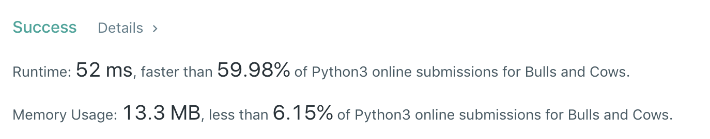

# 299. Bulls and Cows
分类： Array

[题目的地址](https://leetcode.com/problems/bulls-and-cows/)，简单说一下大意：

你正在和你的朋友玩 猜数字（Bulls and Cows）游戏：你写下一个数字让你的朋友猜。每次他猜测后，你给他一个提示，告诉他有多少位数字和确切位置都猜对了（称为“Bulls”, 公牛）A，有多少位数字猜对了但是位置不对（称为“Cows”, 奶牛）B。

这道题的难易程度是 MEDIUM 

如：

Example 1
```
Input: secret = "1807", guess = "7810"

Output: "1A3B"

Explanation: 1 bull and 3 cows. The bull is 8, the cows are 0, 1 and 7.
```
Example 2
```
Input: secret = "1123", guess = "0111"

Output: "1A1B"

Explanation: The 1st 1 in friend's guess is a bull, the 2nd or 3rd 1 is a cow.
```
题目有个重要的提示：
```
Please note that both secret number and friend's guess may contain duplicate digits.
secret 和 guess 都可能含有重复的数字
```
什么意思？

当 secret 和 guess 中同一个数字都出现多次时，最多只有 `min(secret中出现次数，guess中出现次数)` 个奶牛或公牛。

## 我的解法
给定了字符串 `secret` 和 `guess` ，我们只需同时遍历两个数组，当相同位置上的数字相同，那 A 就加 1 。否则，创建两个容量为 10 的数组，分别在正确和错误的数字对应的位置上 `+ 1` ，最后再遍历这两个数组，将 `[0, 10)` 区间内，取两个数组相同位置中小的数，求和，就是 B 了。

代码如下（Python3）🐎：
``` python
class Solution:
    def getHint(self, secret: str, guess: str) -> str:
        A = 0
        B = 0
        marks_S = [0 for i in range(0, 10)]
        marks_G = [0 for i in range(0, 10)]
        secret_int_arr = [int(s) for s in list(secret)]
        guess_int_arr = [int(s) for s in list(guess)]
        for i in range(0, len(secret_int_arr)):
            if guess_int_arr[i] != secret_int_arr[i]:
                marks_S[secret_int_arr[i]] += 1
                marks_G[guess_int_arr[i]] += 1
            else:
                A += 1
        for i in range(0, 10):
            B += min(marks_S[i], marks_G[i])
        return str(A)+"A"+str(B)+"B"
```
虽然是 `O(n)` ，但速度好像不是很快？


看了一下 40ms 的答案，基本思路是一样的，就是在 API 上更加老手 🕊：
``` python
class Solution:
    def getHint(self, secret: str, guess: str) -> str:
        A = 0
        c = [0]*10
        d = [0]*10
        for a,b in zip(secret, guess):
            if a==b:
                A += 1
            else:
                a = ord(a)-ord('0')
                b = ord(b)-ord('0')
                
                c[a] += 1
                d[b] += 1
           
        B = 0
        for a,b in zip(c,d):
            B += min(a,b)
            
        return "%dA%dB" % (A,B)
```